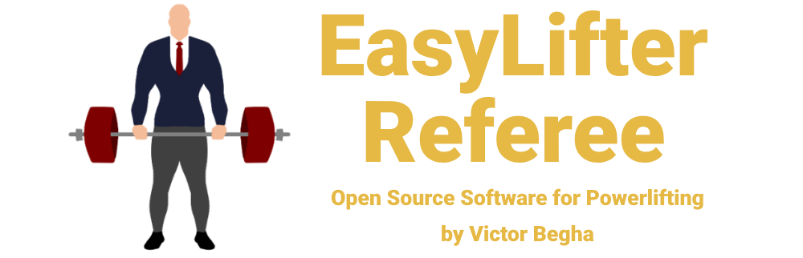

# EasyLifter Referee

EasyLifter Referee is an open source system for powerlifting referees.

It allows referees to select decisions wirelessly from their phones, showing the results to the meet audience - both the 'white' or 'red' lights for 'good lift' or 'no lift', as well as the corresponding colored referee cards under IPF rules.

Additionally, the system also features an easy-to-use, multi purpose timer - it's mainly meant to count down the time for a lift, but can also be used to count compensatory minutes or the time between rounds. Lastly, after each completed lift, it counts down one minute on a separate, individual timer for the lifter to inform their next attempt.

EasyLifter Referee requires no internet access, as many powerlifting meets are held in locations without good connections. Instead, it uses a cheap, widely available ESP32 board to generate its own WiFi network.

## Why

I've seen a few ways referee lights have been implemented in powerlifting meets. The most common is probably with analog white and red lamps; it works, but it's not that pretty, it requires a lot of wiring, and it doesn't feature any way to display the colored referee cards (each of which represents specific rules), requiring the referee to physically raise up a plastic card to show that. Cumbersome.

On the other hand, there are commercial hardware solutions with remote controllers for each referee, integrated timers, and other features. They're quite sophisticated, but also very expensive, which makes them prohibitive for meets at the local and state level (especially if you're outside the US and have to deal with international shipping and unfavorable currency exchange rates).

On April 2024, I became a national powerlifting referee for my country's IPF affiliate, and I started working on this system initially just to improve meet presentation locally. But I quickly realized the sport needs more accessible tools for organizing and running competitions; there's already a lot of expensive equipment involved in strength sports, and when you have to pay out hundreds of dollars just for a decent way to show something as simple as referee decisions, something needs to change. So I hope to contribute positively by creating free, open source software for all things powerlifting, not just refereeing, but eventually other aspects of the sport as well.

## Getting Started

EasyLifter Referee has two main components: a desktop app, and a router built with an ESP32 module.

Installable binaries will soon be available for the desktop app. For the moment, you can install NodeJS (recommended version 18 or higher) and run `npm install` then `npm run start` on the 'app-electron' folder.

For the router, all you need is an ESP32 NodeMCU module, which you can find for cheap on many online stores. Afterwards, you will need to:

- Install CP210x drivers on your computer to allow Windows to recognize it when connected by USB;

- Generate the code with your choosen language and network credentials, using the 'inoCodeGenerator' tool;

- Load the router code through the Arduino IDE.

More detailed instructions for setting up the hardware will be added soon.

Once you have the desktop app running and the router set up, all you have to do is connect the router to your computer with an USB cable. The desktop app will then explain how to connect the referees' phones to the system and use the simple, intuitive web app to select their decisions for each lift.

## Roadmap

- [x] Fully working lights system with desktop app, ESP32 router and mobile webpage.
- [x] Main timer for the competition, plus individual countdowns for informing the next attempts.
- [x] ESP8266 compatibility (so the router can be build either with an ESP32 or an ESP8266).
- [ ] Add modes for weightlifting and for non-IPF powerlifting rulesets. 

## Author

- Victor Begha - https://github.com/victorbegha/

## Copyright Notice

EasyLifter Referee - Free referee lights and timing system for powerlifting

Copyright (C) 2024 Victor Begha

This program is free software: you can redistribute it and/or modify
it under the terms of the GNU General Public License as published by
the Free Software Foundation, either version 3 of the License, or
(at your option) any later version.

This program is distributed in the hope that it will be useful,
but WITHOUT ANY WARRANTY; without even the implied warranty of
MERCHANTABILITY or FITNESS FOR A PARTICULAR PURPOSE. See the
GNU General Public License for more details.

You should have received a copy of the GNU General Public License
along with this program. If not, see [https://www.gnu.org/licenses/](https://www.gnu.org/licenses/).

